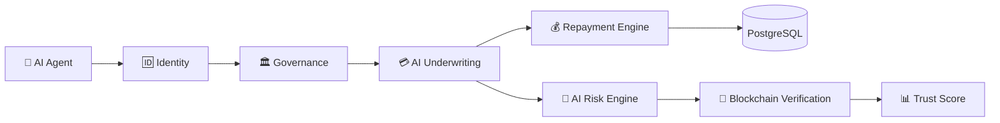

<div align="center">


# 🚀 AgentTrust-OS

### Building the Trust Layer for Autonomous AI Agents

*AI-Powered Identity • Governance • Underwriting • Repayment*


<br>


</div>

---

# 📖 Overview

AgentTrust-OS is an enterprise-grade platform that enables financial trust for autonomous AI agents.

As AI systems begin making autonomous decisions, interacting with digital services, and executing financial transactions, they require a secure trust infrastructure. AgentTrust-OS provides programmable identity, governance, underwriting, and repayment capabilities that allow AI agents to participate safely in financial ecosystems.

The platform combines AI-powered credit evaluation, blockchain-backed trust records, governance policies, and repayment intelligence into one modular architecture.

---

# ✨ Key Features

| Feature | Description |
|----------|-------------|
| 🆔 **Agent Identity** | Secure digital identity for autonomous AI agents |
| 🏛 **Governance Engine** | Trust policies and compliance management |
| 🤖 **AI Underwriting** | Intelligent creditworthiness evaluation |
| 💳 **Programmable Credit** | Automated credit allocation workflows |
| 📊 **Risk Analytics** | Real-time trust and risk scoring |
| 🔗 **Blockchain Verification** | Immutable trust records |
| 📈 **Repayment Intelligence** | Smart repayment monitoring and recommendations |
| ⚡ **REST APIs** | Modular APIs for easy integration |

---

# 🎯 Vision

Our vision is to establish the foundational trust infrastructure that enables autonomous AI agents to securely access programmable credit and financial services while ensuring transparency, accountability, and governance.

---
# 🏗 System Architecture



---

# 🧩 Platform Modules

| Module | Purpose | Status |
|---------|---------|--------|
| 🆔 Identity | Digital identity and authentication for AI agents | ✅ |
| 🏛 Governance | Trust policies and compliance management | ✅ |
| 💳 Underwriting | AI-powered credit evaluation and eligibility | ✅ |
| 💰 Repayment | Loan lifecycle and repayment monitoring | ✅ |

---

# ⚙️ Technology Stack

| Layer | Technology |
|--------|------------|
| Frontend | React 19 + TypeScript + Vite |
| Backend | FastAPI |
| Database | PostgreSQL |
| AI Services | Python |
| Blockchain | Ethereum Compatible Ledger |
| API | REST |
| Version Control | Git & GitHub |

---

# 📂 Project Structure

```text
AgentTrust-OS
│
├── backend/
│   ├── app/
│   │   ├── api/
│   │   ├── modules/
│   │   ├── models/
│   │   ├── schemas/
│   │   └── main.py
│   │
│   └── requirements.txt
│
├── frontend/
│   ├── src/
│   ├── public/
│   └── package.json
│
├── blockchain/
│
├── assets/
│   ├── banner.png
│   └── logo.jpeg
│
└── README.md
```

---

# 🔄 Workflow

```text
AI Agent
    │
    ▼
Identity Verification
    │
    ▼
Governance Validation
    │
    ▼
AI Credit Evaluation
    │
    ▼
Blockchain Trust Recording
    │
    ▼
Credit Decision
    │
    ▼
Repayment Monitoring
```

---

# 🚀 Getting Started

## Prerequisites

- Python 3.12+
- Node.js 20+
- PostgreSQL
- Git

## Clone the Repository

```bash
git clone https://github.com/<your-username>/agenttrust-os.git
cd agenttrust-os
```

## Backend

```bash
cd backend
pip install -r requirements.txt
python -m uvicorn app.main:app --reload
```

Backend runs at:

```
http://127.0.0.1:8000
```

Swagger Documentation:

```
http://127.0.0.1:8000/docs
```

---

## Frontend

```bash
cd frontend
npm install
npm run dev
```

Frontend runs at:

```
http://localhost:5173
```

---

# 🔌 API Overview

| Method | Endpoint | Description |
|---------|----------|-------------|
| GET | `/` | Backend health check |
| POST | `/underwriting/evaluate` | AI underwriting evaluation |

---

# 🔒 Security Features

- 🔐 Secure API architecture
- 🆔 Digital identity verification
- 🛡 Governance policy enforcement
- 🔗 Blockchain-backed trust records
- 📊 AI-powered risk assessment
- 🔒 Modular backend design

---

# 🌍 Real-World Applications

- Autonomous AI Finance
- AI Lending Platforms
- Enterprise Credit Infrastructure
- Multi-Agent Ecosystems
- AI Marketplaces
- Digital Trust Networks

---

# 🛣 Future Roadmap

- ✅ Multi-agent trust network
- ✅ Advanced blockchain integration
- ✅ Federated identity support
- ✅ Explainable AI underwriting
- ✅ Cross-platform API SDKs
- ✅ Enterprise deployment
- ✅ Global programmable credit infrastructure

---

# 🏆 Hackathon Vision

AgentTrust-OS demonstrates how autonomous AI agents can safely participate in financial ecosystems through programmable trust, governance, intelligent underwriting, and transparent credit infrastructure.

The project is designed with a modular architecture that can evolve into an enterprise-grade platform for the next generation of AI-native financial systems.

---

# 🤝 Contributing

We welcome contributions from developers, researchers, and AI enthusiasts.

### Contribution Workflow

1. Fork the repository
2. Create a new feature branch
3. Commit your changes
4. Push your branch
5. Open a Pull Request

---

# 📊 Project Status

| Module | Status |
|---------|--------|
| 🆔 Identity | ✅ Complete |
| 🏛 Governance | ✅ Complete |
| 💳 Underwriting | ✅ Complete |
| 💰 Repayment | ✅ Complete |
| 🎨 Frontend | ✅ Complete |
| ⚙ Backend APIs | ✅ Complete |

---

# 🌟 Why AgentTrust-OS?

Traditional financial systems were built for humans.

AgentTrust-OS introduces a trust-first financial infrastructure designed specifically for autonomous AI agents, enabling secure identity, intelligent underwriting, transparent governance, and programmable credit.

Our goal is to provide the foundation for the emerging AI economy.

---

# 👥 Contributors

Developed during a hackathon by a multidisciplinary team focused on:

- 🤖 Artificial Intelligence
- ⚙ Backend Engineering
- 🎨 Frontend Development
- ⛓ Blockchain Integration
- 📊 Product Design

---

# 📄 License

This project is intended for educational, research, and hackathon purposes.

---

# ⭐ Support

If you found this project useful, please consider giving it a ⭐ on GitHub.

Your support motivates future development and improvements.

---

<div align="center">

## 🚀 AgentTrust-OS

### Building the Trust Layer for Autonomous AI Agents

Made with ❤️ using FastAPI, React, TypeScript, PostgreSQL, Python, and Blockchain Technologies.

</div>