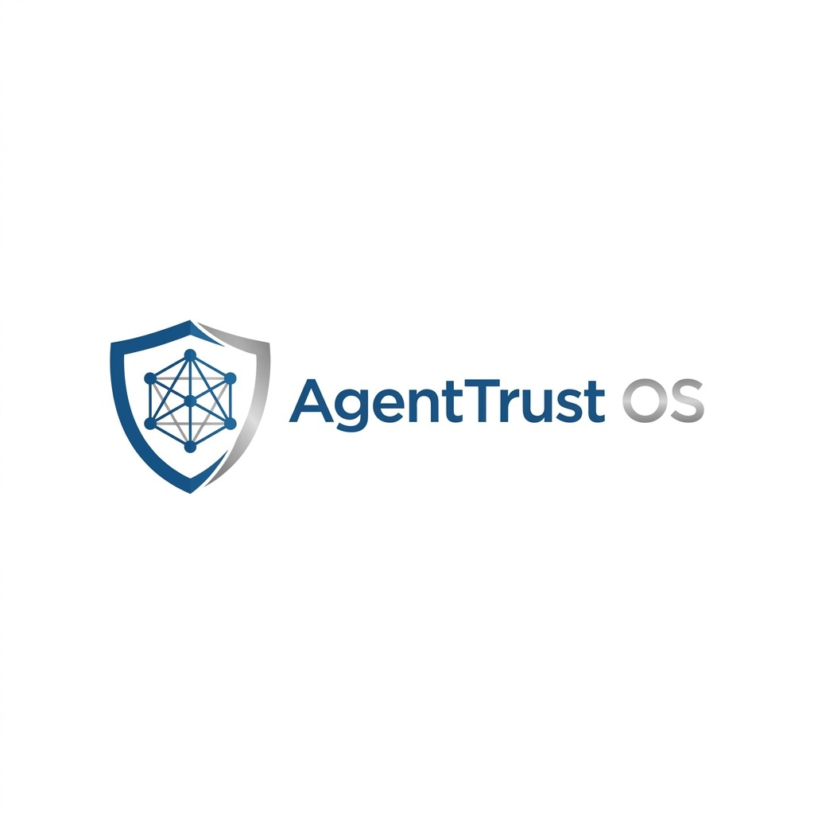
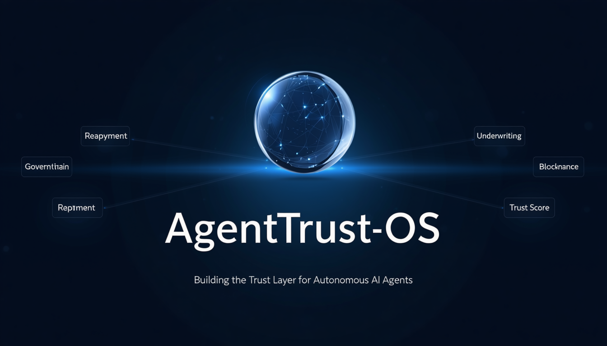
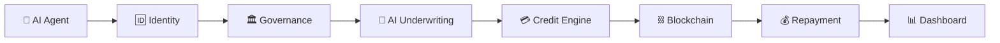
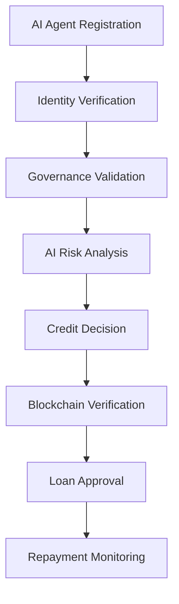

<div align="center">



# AgentTrust-OS

### AI-Powered Programmable Credit Infrastructure for Autonomous AI Agents



</div>


</p>

---

### 🔒 Building the Trust Layer for Autonomous AI Agents

*"Empowering autonomous AI agents with identity, trust, governance, programmable credit, and secure repayment intelligence."*

</div>

---

## 📖 Overview

**AgentTrust-OS** is an enterprise-grade platform that enables autonomous AI agents to establish verifiable identities, build trust, receive intelligent credit decisions, comply with governance policies, and maintain transparent financial histories.

Designed for the future of autonomous AI economies, AgentTrust-OS combines **AI**, **FastAPI**, **React**, **Blockchain**, and **Enterprise Governance** into one unified platform.

---

# ✨ Key Features

- 🔐 **Decentralized AI Identity** – Secure identity layer for autonomous AI agents.
- 🧠 **AI Credit Underwriting** – Intelligent risk analysis and credit evaluation.
- 💰 **Dynamic Credit Engine** – Adaptive credit limits based on agent performance.
- ⛓️ **Blockchain Verification** – Transparent and tamper-proof trust records.
- 🏛️ **Governance Framework** – Policy enforcement and compliance management.
- 📈 **Repayment Intelligence** – Automated repayment tracking and monitoring.
- 📊 **Real-Time Analytics** – Live dashboards for trust, credit, and performance.
- ⚡ **Enterprise Ready** – Modular, scalable architecture built with FastAPI and React.

---

# 🏗️ System Architecture



---

# 🔄 Project Workflow



---

# 🛠️ Tech Stack

| Layer | Technology |
|--------|------------|
| 🎨 Frontend | React 19, TypeScript, Vite |
| ⚙️ Backend | FastAPI |
| 🐍 AI Engine | Python |
| 🗄 Database | PostgreSQL |
| ⛓ Blockchain | Ethereum Ready |
| 🎯 Styling | Tailwind CSS |

---

# 📂 Project Structure

```text
AgentTrust-OS
│
├── backend/
├── frontend/
├── blockchain/
├── docs/
├── assets/
├── README.md
└── requirements.txt
```

---

# 🎯 Vision

**AgentTrust-OS** aims to become the foundational trust infrastructure for autonomous AI agents by combining AI-powered underwriting, decentralized identity, blockchain-backed verification, governance, and intelligent repayment into one unified platform.

---

# 🚀 Getting Started

## Prerequisites

Before running the project, make sure you have:

- Python 3.12+
- Node.js 20+
- npm
- PostgreSQL
- Git

---

## Installation

### Clone Repository

```bash
git clone https://github.com/<your-username>/AgentTrust-OS.git

cd AgentTrust-OS
```

### Backend Setup

```bash
cd backend

python -m venv .venv

source .venv/bin/activate      # macOS/Linux

pip install -r requirements.txt

uvicorn app.main:app --reload
```

### Frontend Setup

```bash
cd frontend

npm install

npm run dev
```

---

# 🌟 Why AgentTrust-OS?

Unlike traditional lending systems built for humans, AgentTrust-OS introduces a programmable financial infrastructure designed specifically for autonomous AI agents.

Our platform combines:

- 🤖 AI-native credit underwriting
- 🔐 Verifiable digital identity
- ⛓ Blockchain-backed trust
- 🏛 Governance & compliance
- 💰 Intelligent repayment monitoring

into one unified operating system.

---

# 📈 Future Roadmap

| Phase | Status |
|--------|--------|
| AI Identity | ✅ Completed |
| Credit Underwriting | ✅ Completed |
| Governance Engine | ✅ Completed |
| Repayment Module | ✅ Completed |
| AI Marketplace | 🚧 Planned |
| Multi-Agent Credit Network | 🚧 Planned |
| Cross-Chain Verification | 🚧 Planned |
| Global AI Credit Infrastructure | 🎯 Vision |

---

# 👥 Contributors

This project was developed as part of a national hackathon by a multidisciplinary team specializing in:

- Artificial Intelligence
- Backend Engineering
- Frontend Development
- Blockchain Integration
- UI/UX Design

---

# 📄 License

This project is intended for educational, research, and hackathon purposes.

---

<div align="center">

## ⭐ If you found this project interesting, please consider giving it a star.

**Building the Trust Layer for Autonomous AI Agents.**

</div>

---

# 📸 Demo

## Dashboard

> *Add screenshots of your application inside the `assets/screenshots` folder.*

| Landing Page | Underwriting |
|--------------|--------------|
|  |  |

| Governance | Repayment |
|------------|-----------|
|  |  |

---

# 🌍 Real-World Applications

- 🏦 Autonomous AI lending
- 🤖 AI Agent marketplaces
- 🏢 Enterprise AI governance
- 💳 Programmable AI credit
- 🌐 Decentralized AI economies
- 🔐 Trust verification for autonomous systems

---

# 🔒 Security

AgentTrust-OS is designed with security as a first-class principle.

- 🔐 Secure AI Identity
- 🛡️ Trust-based Authorization
- ⛓️ Immutable Blockchain Records
- 📜 Governance Policies
- 🔍 Transparent Audit Trails

---

# 📊 Core

---

# 📬 API Overview

| Endpoint | Description |
|----------|-------------|
| `/identity` | Register and verify AI agents |
| `/underwriting/evaluate` | Perform AI credit evaluation |
| `/governance/policies` | Manage governance rules |
| `/repayment` | Track repayments and loan status |
| `/analytics` | Generate dashboards and insights |

---

# 📊 Platform Highlights

<div align="center">

| 🤖 AI Agents | 🛡 Trust Engine | 💳 Credit | ⛓ Blockchain |
|:------------:|:---------------:|:---------:|:-------------:|
| Autonomous Identity | Dynamic Trust Score | Intelligent Underwriting | Immutable Verification |

</div>

---

# 🌐 Enterprise Use Cases

- 🏦 AI Financial Institutions
- 🤖 Autonomous Agent Marketplaces
- 🏢 Enterprise AI Governance
- 🌍 Decentralized AI Networks
- 📈 AI Risk Management
- 💳 Autonomous Lending Platforms

---

# 🏆 Hackathon Vision

AgentTrust-OS reimagines financial infrastructure for autonomous AI systems by combining trust, governance, underwriting, blockchain verification, and repayment intelligence into a unified enterprise platform.

Our vision is to enable AI agents to securely establish identity, earn trust, access programmable credit, and participate in the emerging autonomous AI economy.

---

<div align="center">

## ⭐ Star this repository if you found it useful!

### AgentTrust-OS
### *Building the Trust Layer for Autonomous AI Agents.*

</div>


